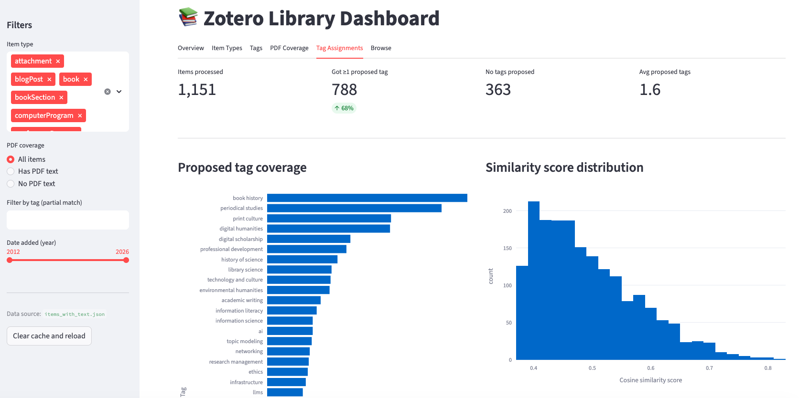
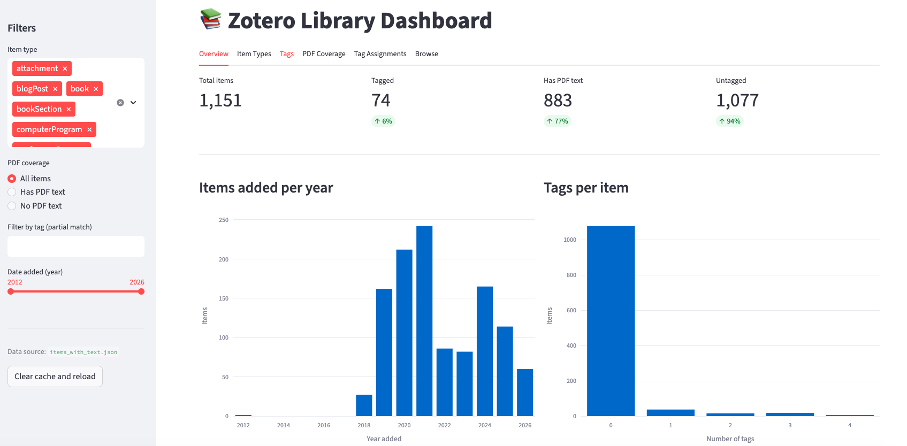

# zotero-autotag

A Python tool for automatically tagging a [Zotero](https://www.zotero.org/) library using a local LLM and semantic similarity. Designed for humanities researchers with large, partially-tagged collections.

## What it does

**Step 1 — Build a controlled vocabulary.** A local LLM (Mistral via [Ollama](https://ollama.com/)) analyzes your library's metadata and existing tags, then proposes a curated tag list. You review and edit the vocabulary before anything touches your library.

**Step 2 — Generate tag descriptions.** A second LLM pass writes a 1–2 sentence description for each tag, grounded in your actual collection. Better descriptions = better semantic discrimination (e.g. "digital humanities" and "environmental humanities" won't bleed into each other).

**Step 3 — Assign tags.** [`sentence-transformers`](https://www.sbert.net/) computes semantic similarity between each item and the vocabulary. Uses PDF full text where available, falls back to metadata (title, abstract, authors, journal). A dry run saves a preview file for inspection before any writes happen.

**Step 4 — Apply to Zotero.** After reviewing the dry run, write tags back to Zotero via the Web API.

**Step 5 — Visualize results.** A Streamlit dashboard shows tag coverage, score distributions, and per-item assignments.

## Design principles

- **No proprietary APIs** — runs entirely with open-source models on your own hardware
- **Non-destructive by default** — items added within a configurable date horizon get new tags added only, not overwritten
- **One protected tag** — the `tbr` (To Be Read) tag is never touched by any code path
- **Human in the loop** — vocabulary and descriptions are reviewed before use; `--apply` requires an explicit confirmation prompt

## Screenshots

### Tag Assignments tab



Coverage after a dry run on a 1,151-item humanities library: 788 items (68%) received at least one proposed tag, average 1.6 tags/item. Top tags by coverage: book history, periodical studies, print culture, digital humanities, digital scholarship.

### Overview tab



Pre-apply library state: 1,151 total items, 883 with extracted PDF text (77%), 74 previously tagged (6%). Items-added-per-year chart spans 2018–2026.

## Requirements

- Python 3.10+
- [Ollama](https://ollama.com/) running locally (Mistral 7B recommended)
- A Zotero account with [Web API access](https://www.zotero.org/settings/keys)
- Local Zotero data directory (for PDF access)

## Setup

```bash
# Clone the repo
git clone https://github.com/YOUR_USERNAME/zotero-autotag.git
cd zotero-autotag

# Create and activate a virtual environment
python3 -m venv venv
source venv/bin/activate   # Windows: venv\Scripts\activate

# Install dependencies
pip install -r requirements.txt

# Copy the secrets template and fill in your values
cp config/secrets.example.yaml config/secrets.yaml
```

Then edit `config/secrets.yaml` with your Zotero API key and local paths. See `config/secrets.example.yaml` for the expected structure.

## Workflow

```
# 1. Fetch your library from Zotero
python scripts/fetch_items.py

# 2. Extract text from local PDFs
python scripts/extract_text.py

# 3. Generate a vocabulary proposal (review data/vocab_proposals.yaml afterward)
python scripts/generate_vocab.py

# 4. Generate tag descriptions (review descriptions in vocab_proposals.yaml)
python scripts/generate_descriptions.py

# 5. Dry run — compute assignments, save to data/cache/tag_assignments.json
python scripts/assign_tags.py

# 6. Inspect the preview
#    data/cache/tag_assignments.json — proposed vs. final tags, per item
#    streamlit run scripts/dashboard.py — visual overview

# 7. Apply when satisfied
python scripts/assign_tags.py --apply
```

## Configuration

All tuneable parameters live in `config/settings.yaml`:

| Setting | Default | Effect |
|---------|---------|--------|
| `pipeline.similarity_threshold` | `0.38` | Minimum cosine similarity to assign a tag |
| `pipeline.max_tags_per_item` | `3` | Maximum tags per item |
| `pipeline.date_horizon_days` | `30` | Items newer than this get add-only (not overwrite) |
| `pipeline.protected_tags` | `[tbr]` | Tags that are never modified |
| `pipeline.embedding_model` | `all-mpnet-base-v2` | Sentence-transformers model for similarity |
| `model.name` | `mistral` | Ollama model for vocabulary + description generation |

## Project Phases

| Phase | Description | Status |
|-------|-------------|--------|
| 1 | Project scaffolding | Complete |
| 2 | Zotero connector — fetch items + metadata via API | Complete |
| 3 | PDF extractor — pull full text from local attachments | Complete |
| 4 | Vocabulary generator — local LLM proposes controlled vocabulary | Complete |
| 5 | Tag assigner — apply vocabulary with date-horizon logic | Complete |
| 6 | Test harness — evaluate on random sample, iterate | Pending |
| 7 | Docs + packaging | In progress |

## License

MIT
